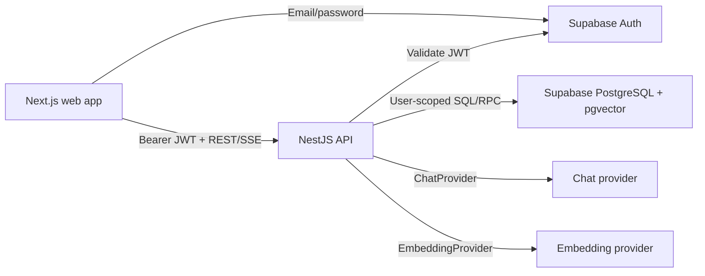
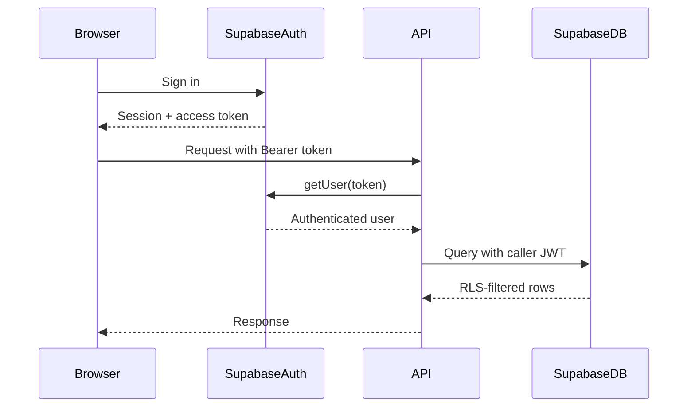
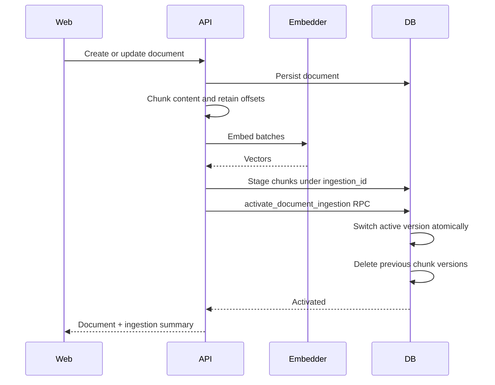
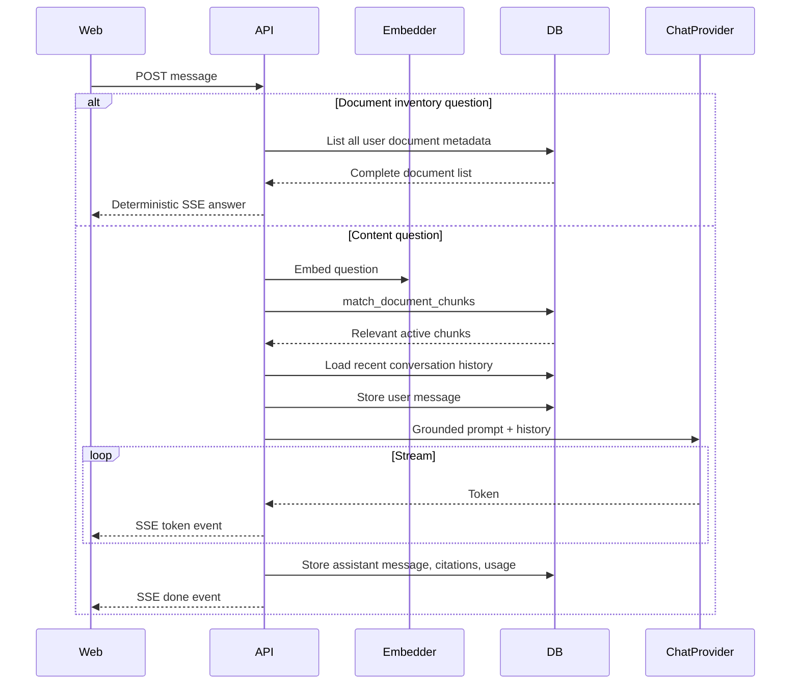

# Architecture

## System Overview

The browser owns session acquisition and presentation. The API owns business workflows. Supabase owns identity, persistence, tenant enforcement, and vector search.

## Workspace Responsibilities

### `apps/web`

- Authentication screens
- Protected application shell
- Document management UI
- Streaming chat UI
- Citation navigation and highlighting
- Model settings
- Usage summaries
- Supabase browser session
- API and SSE clients

TanStack Query manages server state and invalidation. Local React state manages editors and active streams.

### `apps/api`

- Supabase token verification
- Document CRUD
- File extraction
- Chunking and indexing
- Retrieval
- Prompt construction
- Provider selection
- Conversation persistence
- Usage recording
- Rate limiting
- Health reporting

NestJS modules group behavior by domain rather than transport mechanics.

### `packages/ai`

- `ChatProvider` port
- `EmbeddingProvider` port
- Future `RerankProvider` port
- OpenAI-compatible adapters
- Ollama adapters
- Environment configuration
- Provider registry
- Provider-specific error types

The package has no NestJS or frontend dependency.

### `packages/shared`

- Zod request schemas
- API error codes
- Document and conversation types
- Citation types
- Model options
- RAG defaults
- Shared display and title utilities

## Authentication Request Flow

The API deliberately does not use the service role for user operations. This keeps RLS effective even if an application-level filter is accidentally omitted.

## Document Ingestion Flow

If embedding or insertion fails, only staged rows are deleted. The previously active index remains queryable.

For updates, the API restores the previous document content when reindexing fails so stored source content and active embeddings remain consistent.

## Chat Flow

Inventory questions deliberately bypass vector search and the chat model. Semantic retrieval is appropriate for document content, but it cannot reliably enumerate every database record from only the nearest chunks.

## Key Decisions

### Separate API instead of Next.js handlers

This preserves a backend boundary around AI and data workflows, makes long-running streaming behavior explicit, and gives domain modules independent testability.

### Ports and adapters for AI

The core application is insulated from provider SDK shapes. New providers implement a small domain interface and are registered centrally.

### PostgreSQL RPC for vector search

Similarity search stays close to indexed data and is expressed as a versioned database contract.

### RLS plus explicit filters

RLS is the security boundary. Explicit `user_id` filters improve clarity, reduce accidental broad queries, and provide defense in depth.

### Synchronous ingestion

Synchronous ingestion keeps this assessment easy to run and reason about. Atomic activation reduces failure risk. The tradeoff is request latency for larger documents.

### Persistent conversations

Persisting messages allows conversation continuity and provides the history needed for multi-turn chat.

## Failure Behavior

| Failure | Behavior |
| --- | --- |
| Invalid JWT | `401 UNAUTHORIZED` |
| Invalid request | `400 VALIDATION_ERROR` |
| Missing user-owned resource | `404 NOT_FOUND` |
| Rate limit exceeded | `429 RATE_LIMITED` |
| Embedding failure on create | New document is removed |
| Embedding failure on update | Previous content and active index remain |
| Chat provider failure | SSE `error` event |
| Unexpected API exception | Generic `500 PROVIDER_ERROR` |

## Scaling Path

The current boundaries permit the following without rewriting the application:

- Move ingestion to a worker queue
- Add object storage for original files
- Add a reranker adapter
- Replace direct retrieval with hybrid search
- Add provider fallback or load balancing
- Add OpenTelemetry instrumentation
- Partition or archive old usage and message data
